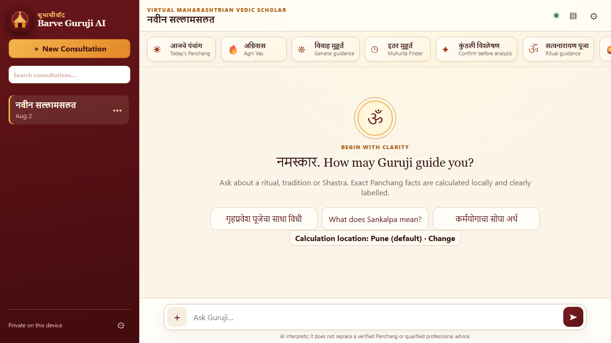
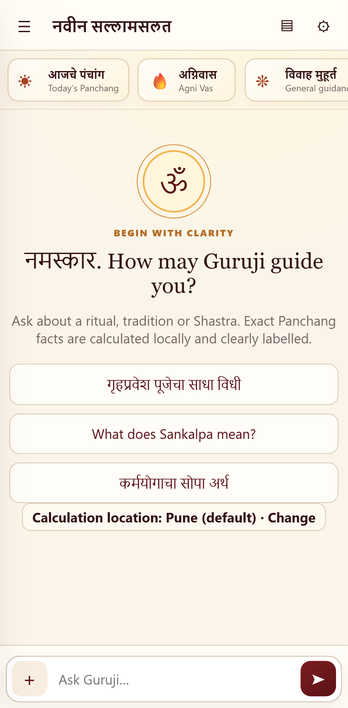

# Barve Guruji AI

Barve Guruji AI is a frontend-only, installable PWA for educational guidance about Hindu Panchang concepts, Jyotish, rituals, Maharashtrian traditions, Shastra and spiritual practice. It runs from GitHub Pages at `/BarveGurujiAi/`, stores consultations locally, and asks each user to supply their own Gemini API key.

The application separates deterministic facts from AI interpretation. It never asks Gemini to invent exact Tithi, Nakshatra, Rashi, Lagna, Dasha, Muhurta, sunrise, sunset or Agni Vasa values. Missing or unvalidated data is labelled as unavailable or provisional.

## Screenshots

- Desktop: consultation sidebar, compact cultural header, local calculation cards and a sticky chat composer.
- Mobile: drawer navigation, horizontal quick actions and a safe-area-aware composer.





The final implementation keeps the maroon, saffron and cream visual language while removing Tailwind CDN and Google Fonts dependencies.

## Local development

Requirements: Node.js 20 or newer and npm.

```bash
npm ci
npm run dev
```

Vite serves the source application locally. Production verification:

```bash
npm run lint
npm run typecheck
npm test
npm run build
npm run preview
```

Essential browser tests use Playwright:

```bash
npx playwright install chromium
npm run test:e2e
```

Automated tests mock or avoid Gemini. CI never needs or consumes an API key.

## Gemini API key setup

Open Settings, enter a key created in [Google AI Studio](https://aistudio.google.com/app/apikey), and select **Save key**. The default stores it in `sessionStorage`, so it disappears with the browser session. **Remember on this device** moves it to `localStorage` only after a separate warning. An optional inactivity timer can forget either form of stored key after 15, 30 or 60 minutes.

Important: a browser-only app cannot securely conceal an API key. Scripts running on the same origin can access browser storage. Use a key restricted to the Gemini API, monitor usage, and revoke it when necessary. Keys are never bundled, logged, stored in IndexedDB, or included in consultation exports.

The official `@google/genai` SDK uses fixed defaults:

- Primary: `gemini-2.5-flash`
- Manual fallback: `gemini-2.5-flash-lite`

Settings reject `latest` aliases. Normal chat uses one streaming Gemini request per user turn. The prior interpreter → Guruji → translator pipeline and duplicate latest-user message are gone.

## Attachments and Kundali confirmation

The composer accepts JPEG, PNG, WebP and PDF through the picker, desktop drop, clipboard paste, or mobile gallery/camera support where the browser exposes it. Blob originals are stored in IndexedDB—not as base64 in chat JSON. Before the first use, the app explains that selected files are sent to Gemini.

Small images use SDK `inlineData`. PDFs and larger media use the Gemini Files API, wait for processing, and retain the remote URI only for the required context. Current documented PDF/request size errors are handled explicitly. A Reference Library can keep Panchang PDFs, family notes, Shastra sources and Kundali reports local until the user attaches them.

Kundali analysis is two-stage:

1. Gemini performs schema-constrained visible-field extraction with confidence and ambiguity fields.
2. The user reviews and corrects the JSON before confirming a `VerifiedChart`.

No prediction starts before confirmation. Chandra Rashi is derived only from the confirmed Moon placement. Unclear Dasha information is never approximated.

## Panchang, Agni Vasa and Muhurta accuracy

The local Panchang foundation uses the MIT-licensed, browser-compatible [Astronomy Engine](https://github.com/cosinekitty/astronomy) for Sun/Moon positions and sunrise/sunset. It calculates Vara and daylight divisions such as Rahu Kaal deterministically. Tithi, Nakshatra, Yoga, Karana and Moon Rashi calculations are present but deliberately labelled **provisional** until an independently sourced Panchang fixture set is licensed and checked. Calculation cards always show location, timezone, method, ayanamsa label, generated time and warnings.

Agni Vasa uses a readable, versioned Tithi–Vara modulo-four rule. The UI shows inputs, arithmetic, remainder, mapped location and the selected rule’s Homa recommendation, with a Sampradaya warning.

Complex Muhurta generation is disabled as **general guidance only** until category-specific rulesets and fixtures are validated. The app returns no invented dates. See [Accuracy](docs/ACCURACY.md) and [Panchang validation](docs/PANCHANG_VALIDATION.md).

## Storage, privacy and backup

IndexedDB stores consultations, messages, attachment blobs, verified charts, reference documents and calculation cache. On first launch it copies legacy `bg_sessions`, `bg_active_session_id` and `bg_language` data into the versioned schema without deleting the old source values.

Exports contain consultation and message records only; API keys and attachment blobs are excluded. Imports require the v2 backup shape, cap record counts and text sizes, discard imported status/attachment references, and render content through bundled Markdown plus DOMPurify.

Offline mode supports stored consultations and local calculations. Gemini answers and file uploads require internet. See [Privacy](docs/PRIVACY.md).

## Installation, updates and repair

- Android/desktop: use **Install app** when the browser exposes the install prompt.
- iPhone/iPad: **Share → Add to Home Screen**.

The generated service worker is scoped to `/BarveGurujiAi/`; it never caches the domain root or Gemini requests. Navigations are network-first and hashed assets are stale-while-revalidate/pre-cached. When a worker is waiting, the app shows an update banner and reloads once after `SKIP_WAITING`/`controllerchange`.

**Repair / Hard Refresh App** deletes only this application’s Cache Storage entries and unregisters its scoped service worker before a cache-busted reload. Chats, attachments, settings and API key remain by default. Clearing all local data requires an explicit checkbox and second confirmation.

## GitHub Pages deployment

Vite is configured with:

```ts
base: "/BarveGurujiAi/"
```

Push the repository to GitHub and enable **Settings → Pages → Build and deployment → GitHub Actions**. The workflow in `.github/workflows/deploy-pages.yml` runs install, lint, typecheck, unit tests, production build, and deploys `dist/`. The UI uses state rather than client-side path routes, so server rewrites and a `404.html` fallback are not required.

## Architecture

- `src/ai`: official SDK client orchestration, attachments, errors and structured Kundali extraction
- `src/domain`: deterministic Panchang foundation, Agni Vasa rules, and explicitly limited Muhurta engine
- `src/storage`: IndexedDB schema/repositories, legacy migration and backup validation
- `src/pwa`: install, update and scoped repair lifecycle
- `src/prompts`: versioned persona and extraction prompt
- `src/ui`: static accessible application shell
- `tests` / `e2e`: reliability and browser coverage

Detailed decisions and the legacy audit are in [Architecture](docs/ARCHITECTURE.md).

## Known limitations

- Traditional Panchang fields and Lahiri ayanamsa are provisional until verified against licensed, cited almanac fixtures across seasons and locations.
- Personal birth-chart calculation, Dasha computation and verified planetary transit data are not implemented. The app accepts only a user-confirmed uploaded chart.
- Category-specific and personalised Muhurta rules are disabled; no AI-generated dates replace them.
- Remote Gemini files normally expire. Best-effort deletion is implemented in the attachment service, but the UI does not yet offer a remote-file audit screen.
- Attachment blobs are not included in the compact JSON backup format.
- A frontend-only application cannot make a browser-held API key secret.
