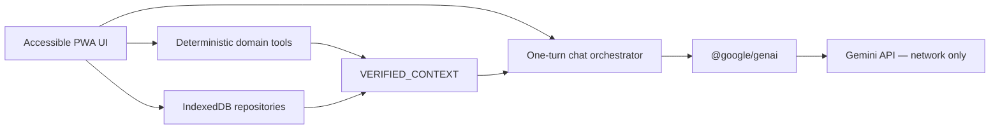

# Architecture and legacy audit

## Diagnosed legacy issues

The original repository was five runtime files: `index.html`, `app.js`, `sw.js`, `manifest.webmanifest` and a single SVG icon. Useful behavior included consultations, import/export, a language switch, quick prompts, offline notice and a basic PWA manifest. Those concepts were retained, but their implementation was unsafe or unreliable.

The confirmed history defect was:

1. `insertUserMessage` pushed the original user message into `session.messages`.
2. `buildGurujiPayload` mapped all `session.messages`, including that newly stored user turn.
3. It then appended `finalUserText` as another user content.

The same user turn therefore appeared twice, with adjacent user roles. In addition, each normal turn could call Gemini once to reinterpret the query, once to answer, and once to translate back to Marathi. The interpreter used a mutable `latest` model alias, the translator could change meaning, no response streamed, the stop control was absent, errors and birth data could be written to the production console, and rate-limit auto-retry risked another submission.

Other findings:

- the API key was always persisted in `localStorage`;
- session JSON and the key shared unversioned browser storage;
- language changes unexpectedly created a new consultation;
- imports accepted arbitrary object shapes and later rendered HTML;
- the service worker cached `/`, immediately skipped waiting, used cache-first for HTML, and cached unrelated cross-origin resources;
- the manifest referenced PNG icons that did not exist;
- Tailwind and Google Fonts were runtime CDN dependencies;
- all “Panchang”, Agni Vasa and Muhurta quick actions were prompts asking Gemini to invent calculations;
- the persona claimed exact calculations, live almanac adherence, Tarot activity and a real human identity;
- there was no attachment, IndexedDB, accessibility-focused mobile drawer, update UI, or repair path.

## Current boundaries

The app is a static Vite/TypeScript build with no backend. Modules are separated into AI orchestration, deterministic domain work, storage, PWA lifecycle, prompts and UI.

`VerifiedContext` carries source type, date/location metadata, warnings, provisional Panchang data, confirmed chart data, deterministic Agni Vasa and verified Muhurta slots. The system instruction makes the block authoritative and prohibits filling missing values.

## Chat lifecycle

1. Store the original user message once.
2. Resolve relative dates locally for the request copy.
3. Calculate a context only for date-sensitive intents; otherwise send a `sourceType: none` warning.
4. Build completed user/model history through the current user ID. Calculation cards, streaming placeholders, stopped responses and failed messages are excluded. Consecutive roles are merged.
5. Replace the current turn’s text part with its resolved text, verified block and its own/pinned attachment parts.
6. Apply the versioned persona through `config.systemInstruction` and call `generateContentStream` once.
7. Inspect finish/block reasons, persist a completed response, or persist a visible stopped/failed state.

Regeneration removes the selected assistant response and reuses the preceding stored user turn. Edit mutates that user turn, removes its immediate assistant response and sends the corrected turn. Neither path adds a duplicate user message.

## Storage and migration

IndexedDB database `barve-guruji-ai`, schema v3, has stores for consultations, messages, attachments, references, calculation cache and migration metadata. The legacy migration copies valid sessions/message text once and keeps legacy browser keys untouched as a rollback source. Keys remain only in session/local storage by explicit user choice.

## Attachments and chart verification

Attachment blobs are tied to a session and later a user message. Message-only and pinned modes are distinct. Small images become inline parts; PDFs and larger files use the SDK Files API. Kundali requests enter schema-constrained extraction instead of chat, then pause at editable confirmation. Only the resulting `VerifiedChart` is injected into later turns.

## PWA and security

Vite base, manifest ID/start/scope and service-worker URLs are `/BarveGurujiAi/`. The build generates a versioned worker and pre-cache list from `dist`. HTML/navigation is network-first; static files are cache-first with background refresh; `googleapis.com` is untouched. A waiting worker requires user action.

The CSP permits local scripts/styles/assets and only required Google API connections. Markdown is bundled and passed through DOMPurify. No runtime fonts/CDN or unsanitised model/import HTML is used.
